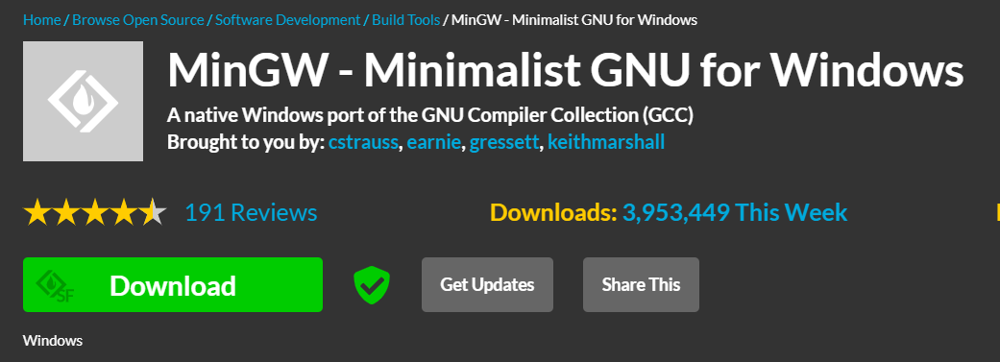

# how to install and run C.
C is a versatile and efficient programming language used for system software, applications, and embedded systems. Known for its flexibility and speed, C allows direct access to hardware and offers a rich set of features for low-level programming while being widely used across various domains due to its portability and powerful capabilities.
### Steps to Install:

1. **Download MinGW:** Search for "MinGW for Windows" or visit [MinGW Download](https://sourceforge.net/projects/mingw/) to download the installer. 

2. **Run MinGW Installer:** Once downloaded, open the installer and follow the instructions. Choose the necessary components like the C compiler (`gcc`) during installation.

3. **Complete Installation:** Follow the prompts to complete the installation process.

4. **Locate MinGW Folder:** Find the MinGW installation folder, usually in `C:\MinGW\bin`.

5. **Add MinGW to System Path:**
   - Open System Properties.
   - Go to the "Environment Variables" section.
   - Under "Path", add a new entry with the MinGW bin path (e.g., `C:\MinGW\bin`).

6. **Test:** run `gcc -v`, if you got output some thing like this means **yureka**.

```
Using built-in specs.
COLLECT_GCC=C:\MinGW\bin\gcc.exe
COLLECT_LTO_WRAPPER=c:/mingw/bin/../libexec/gcc/mingw32/6.3.0/lto-wrapper.exe
Target: mingw32
Configured with: ../src/gcc-6.3.0/configure --build=x86_64-pc-linux-gnu --host=mingw32 --target=mingw32 --with-gmp=/mingw --with-mpfr --with-mpc=/mingw --with-isl=/mingw --prefix=/mingw --disable-win32-registry --with-arch=i586 --with-tune=generic --enable-languages=c,c++,objc,obj-c++,fortran,ada --with-pkgversion='MinGW.org GCC-6.3.0-1' --enable-static --enable-shared --enable-threads --with-dwarf2 --disable-sjlj-exceptions --enable-version-specific-runtime-libs --with-libiconv-prefix=/mingw --with-libintl-prefix=/mingw --enable-libstdcxx-debug --enable-libgomp --disable-libvtv --enable-nls
Thread model: win32
gcc version 6.3.0 (MinGW.org GCC-6.3.0-1)
```

### Ready to Code:

Now, you're ready to write and run C programs on your Windows system using any text editor like Notepad, Visual Studio Code, or Dev-C++.


1. **Create a C File:** Start by creating a file with any name and the `.c` extension. For example:
    ```
    Helloworld.c
    ```

2. **Add Code:** Put this sample code in the file:
    ```c
    #include <stdio.h>
    
    int main() {
        printf("Hello from C");
        return 0;
    }
    ```

3. **Run in Terminal:**
   - **For Windows:**
     Open the terminal in the same directory as the filename.
     Execute:
     ```bash
     gcc filename.c
     ./a.exe
     ```
   - **For Other Operating Systems:**
     Open the terminal in the same directory as the filename.
     Execute:
     ```bash
     gcc filename.c
     ./a.out
     ```
   **This will display the output in the terminal. 👍**
