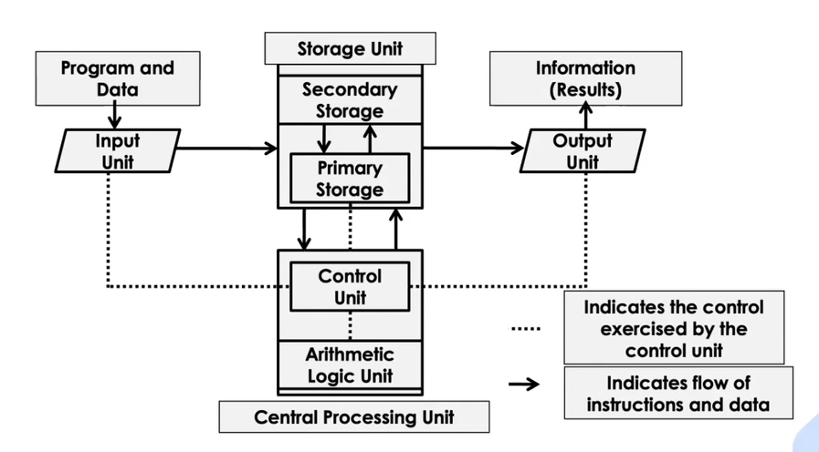

# Introduction of computers

## Computer

It comes from the word "compute," which means to calculate. It is a device that operates on data.

### Basic Functions

It performs the following five basic operations for converting raw input data into useful information and presenting it to the user:

- **Inputting:** Process of entering data and instructions into a computer system.

- **Storing:** Saving data and instructions to make them readily available for initial or additional processing as and when required.

- **Processing:** Performing arithmetic operations (add, subtract, etc.) or logical operations (comparisons like equal to, less than, etc.) on data to convert them into useful information.

- **Outputting:** Process of producing useful information or results for a user, such as printed reports or visual displays.

- **Controlling:** It is like the brain—it manages and directs the activities of the other parts of the computer. The control unit oversees the flow of data and instructions within the CPU (Central Processing Unit) and coordinates the actions of the entire computer system. The control unit interprets instructions from the computer's memory, decodes them, and then executes or carries out those instructions by directing the other parts of the computer to perform specific tasks.

## Central processing unit (CPU )

it consists of the fowwlowing features

- cpu is considered as the brain of the computer.
- cpu performs all types of data processing operations.
- it stores data, intermediate results and instructions {program}
- it controls the operations of all parts of the computer.

## Input Unit

- it accepts (or readds) instructions and data from outside world.
- it converts these instructions and data in computer acceptable form.
- it supplies the converteed instructions and data to comput er system for futher processing.

## Output Unit

- it accepts the results produced by the computer,which are in coded form and hence,
  we cannot easily understand them.

- it converts these coded results to human acceptable (readable) form.

### it holds (store):

- Data and instruction required for processing ( recieved from input devices.)
  intermediate results of processing.
  results for output, before they are released to an output device.

### Types:

Primary Storage: Also known as main memory, is used tohold pieces of programs instructions and data, intermediate results of processing and recently produced results of those jobs on which computer is currently working. it can hold information only while computer system is on.
Secondary Storage: describtions 

## ALU (arithmetic logic unit)
this unit conststs of two sebsectiosn namely, 
### Airthemetic section
- Function of arithmetic section is to perform arithmetic operationslike adddition, subtract, multiplication adn deivision all complex operation are done by making reperitive use of the above operations.

### logic section 
function of logic sections is to perform logic operations such as comparing selecting, matching and merging of data.

## secondary storage : 
from chatgpt 

## control Unit: 
from chatgpt 

Functions of the control unit
